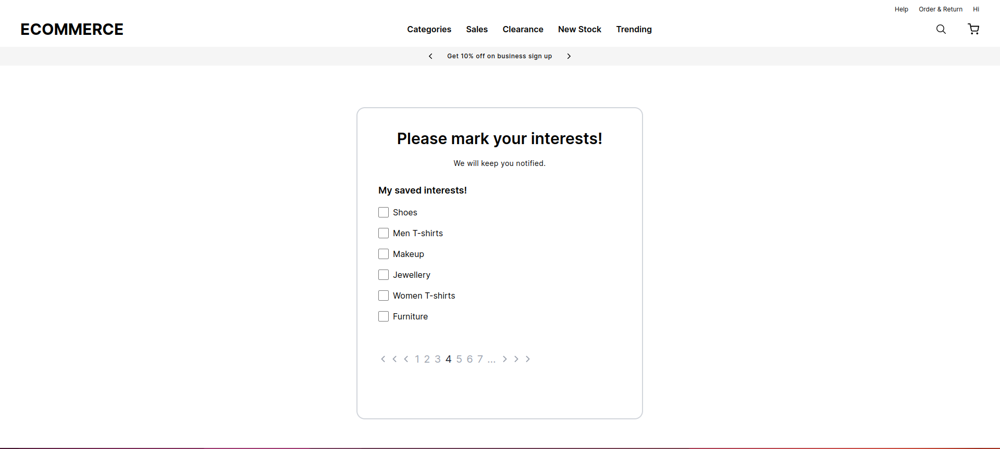
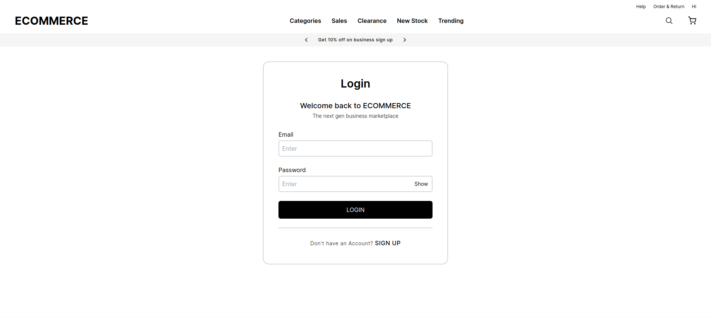
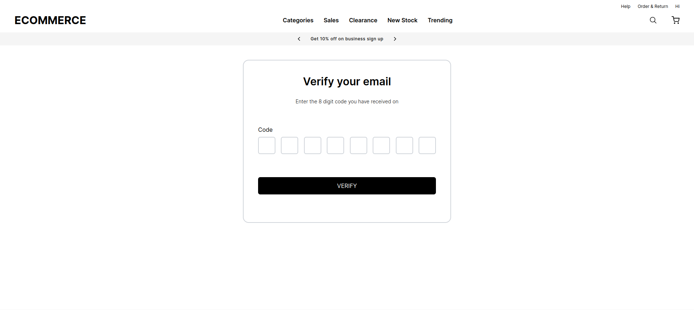

# Moonshot Assignment

This repository contains the solution for the MERN Moonshot test provided on March 15, 2024. The objective of this assignment is to develop a simple sign-up and login flow for an e-commerce website, allowing users to mark categories they are interested in.




## Design Link
[Figma Design](https://www.figma.com/file/EjNZkDNTtgERV5PgF0mxnt/MERN-Assignment?type=design&node-id=33%3A667&mode=design&t=6k9GiDcswPavM0TD-1)

## Objective
Develop a sign-up and login flow for an e-commerce website, allowing users to:
- Register new accounts
- Login to existing accounts
- Mark categories of interest
- Access a protected page displaying categories

## Technologies Used
- **Framework:** Next.js
- **Styling:** Tailwind CSS
- **Database:** MySQL
- **API Handling:** Axios

## Features
1. **User Registration:** Users can sign up by providing their details.
2. **User Login:** Existing users can log in using their credentials.
3. **Category Selection:** Users can mark categories they are interested in.
4. **Protected Page:** A protected page accessible only to logged-in users, displaying categories.
5. **Pagination:** Categories are paginated, with 6 categories visible per page.
6. **Persistent Selection:** User's category selections are stored in the database, persisting across sessions.

## Screenshots

### Signup page


### Login page


### OTP-Validation


## Getting Started

1. Clone the repository:

```bash
    git clone https://github.com/AnchalDevBytes/moonshot-assignment
```
2. Go to the project directory and open with VS-Code
```bash
    cd moonshot-assignment
    code .
```

3. Rename the ```.sample.env``` and paste your database credentials

4. Install Dependencies

```bash
    npm install
```

5. Run the Developement Server

```bash
    npm run dev
```

6. Open http://localhost:3000 in your browser to view the application.

## Deployment
Deploy the app on Vercel's free tier or any other Next.js hosting provider.


## Conclusion
This project demonstrates a simple yet functional authentication system with category selection for an e-commerce website. It utilizes Next.js for server-side rendering, Tailwind CSS for styling, and MySQL for database management.
